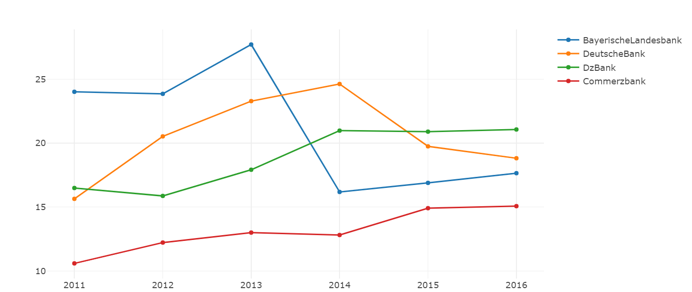

## Overview
- use programming language `python` with library `spacy`
- apply methods `TF/IDF` and `LDA` to analysis the text 
<br>

## Folder/Structure
- [html](/html/) contain all the html-version files including graphs
- [img](/img/) contain the charts from the result of two methods `TF/IDF` and `LDA`
- [presentation](/presentation/) has the slides of our presentation
- [src](/src/) has all the configurations we need
- file [LDA](/LDA.ipynb) apply the method `LDA`
- file [TFIDF](/TFIDF_company_chart.ipynb) apply the method `TF/IDF`

<br>

## Theory and Algorithm

### preprocessing
- remove all the unnecessary symbols
- remove all the stop words
- remove all the numbers
- transfer all the words into lowercase
- classify all the words with their lemma

### TF/IDF
- Stand for **term frequency-inverse document frequency**
- Our goal: find out the most important words from certain text and learn the key words trend during several years
- Processing: input text file &rarr; results
* take BMW as example
```
input [BMW-AnnualReport-2010 to 2017]
do Reprocessing
output content
```
```
input content
do TF/IDF
output TF/IDF-matrix
```
- Result: all the words with importance value

### LDA
- Stand for **Latent Dirichlet Allocation**
- Our goal: find out several topics from certain text, know the main pages of certain topic and learn the topics trend during several years
- Processing: train the model &rarr; input text file &rarr; results 
- take Commerzbank as example
```
input [many reports from the bands]
do Preprocessing
do Train the model
output model
```
```
input commerzbank_report
do LDA
output topics
```
- Result: topics of the text

<br>

## Result
- Visualization: use library `plotly` to draw the charts

### TF/IDF


### LDA



<br>

## Reference
- library spacy reference https://spacy.io/ 


